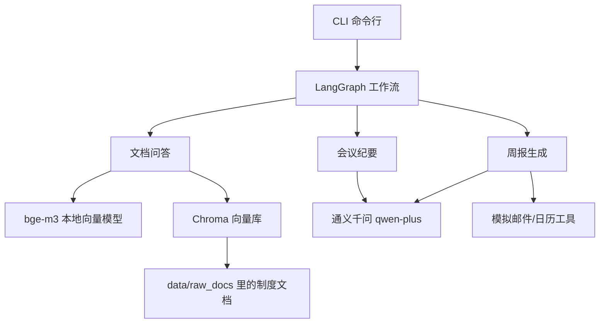

# 企业办公自动化 Agent

一个用 LangGraph 做的办公自动化练手项目，实现了三个场景：**制度文档问答（RAG）、会议纪要自动整理、自动周报生成**。

## 关于开发方式（如实说明）

这个项目是我在 **AI 编程助手（Codex）的辅助下完成的练习项目**，我把自己定位为第二作者：

- **我负责的部分**：需求和验收标准的设计、技术方案的选择（在助手给的几个方案里做决定）、看懂每一段生成的代码、跑通和调试、写测试用例、验证效果
- **Codex 辅助的部分**：大部分代码由 AI 生成初稿，我负责审查、提问、让它反复修改
- 项目里每一个模块的原理我都能讲清楚，下面"我学到了什么"一节是我自己的理解，不是抄来的

这也是我现在写代码的真实方式：自己先想清楚要什么，再让 AI 帮我写，最后自己跑通、验证、搞懂。

---

## 这个项目能做什么

### 1. 制度文档问答

向公司制度文档提问，答案会**带上出处**（来自哪个文件的哪个章节）。知识库里没有的问题会直接说"找不到"，而不是瞎编。

```bash
python -m office_agent.main ask "入职第一年有几天年假？"
```

- 问年假：能答对，并引用《员工假期管理办法》的具体章节
- 问"怎么做提拉米苏"：最高分只有 0.325，低于 0.5 的阈值，直接拒答
- 加 `--scope department=IT` 可以只在 IT 部门的文档里找

### 2. 会议纪要整理

把一段会议记录文本丢进去，自动提取摘要、决议和待办（任务、负责人、截止日期），靠谱的待办会自动记到日历上（目前是模拟日历）。

```bash
python -m office_agent.main meeting --time 2026-09-14T10:00:00
```

示例里能看到几个我特意设计的细节：
- "明天""下周一""下周五"会被换算成具体日期
- 提到的"小赵"不在参会名单里 → 负责人标成"待确认"，**不会乱猜一个人**
- 只有置信度 ≥ 0.8 且负责人明确的待办才会自动建日程

### 3. 自动周报

模拟从邮件、日历、任务系统三个地方拉本周的工作，去重后生成四段式周报（本周完成 / 进行中 / 风险与阻塞 / 下周计划）。**草稿必须人工确认后才会"发送"**。

```bash
python -m office_agent.main report --start 2026-09-08 --end 2026-09-12
# 生成草稿后输入 a 确认发送 / r 提修改意见 / d 丢弃
```

同一件事如果在邮件和日历里都出现了（示例里故意放了重复数据），会按标题去重，9 条数据最后合并成 8 条。

---

## 整体流程



三个场景各是一张 LangGraph 状态图，我对它们的理解：

- **问答图**：检索完先判断最高分够不够，不够就直接拒答（一条条件分支）；生成完发现没带引用，就重新生成一次（一条往回走的边，最多重试 1 次）
- **会议图**：LLM 输出先用 Pydantic 检查格式，不合格就把报错信息塞回去让它重答，最多 2 次；再不行就保留已经提取出来的部分，标记为待人工确认
- **周报图**：草稿生成后图会"暂停"（LangGraph 的 interrupt），等人确认后再继续——暂停时状态存在 checkpointer 里，这是我觉得 LangGraph 比普通链式调用好用的地方

---

## 技术栈（以及我为什么这么选）

| 技术 | 用在哪 | 选择理由（我自己的理解） |
|---|---|---|
| Python 3.10+ | 全部 | AI 生态最成熟 |
| LangGraph | 工作流编排 | 需要"条件分支、失败重试、人工确认"这些流程，普通的 Chain 写起来会是一堆 if-else，画成图更清楚 |
| LangChain | 模型/检索组件 | 和 LangGraph 是一家，接口配套 |
| Chroma | 向量库 | 嵌入式的，不用单独起服务，练习项目几万条数据够用；自带元数据过滤（按部门筛选要用到） |
| bge-m3 | 向量模型 | 本地跑、免费、中文效果好，办公文档不用传到外网 |
| 通义千问 qwen-plus | 对话模型 | 便宜、中文好；通过 OpenAI 兼容接口接入，换 DeepSeek 只要改配置 |
| pytest | 测试 | 一共 31 个测试 |
| Docker | 部署 | 练了一下容器化，向量库和模型权重用 volume 挂载 |

没有选的方案也说一下：Agent 框架我对比过 CrewAI 和 AutoGen，它们更像"让几个 AI 角色自己商量着干活"，适合开放式任务；但办公场景里"发错邮件、派错活"代价比较大，我更需要流程是确定的，所以选了状态图风格的 LangGraph。

---

## 怎么跑起来

### 环境准备

- Python 3.10 及以上
- bge-m3 模型权重约 2.3GB（放 `models/bge-m3` 目录，CPU 就能跑）

### 安装

```bash
python -m venv .venv
# Windows
.venv\Scripts\activate

pip install -r requirements.txt
pip install -e . --no-deps
```

### 下载向量模型（第一次需要）

```bash
python -c "from modelscope import snapshot_download; snapshot_download('BAAI/bge-m3', local_dir='models/bge-m3')"
```

### 配置大模型

复制 `.env.example` 为 `.env`，填入 API Key：

```env
OFFICE_AGENT_LLM__API_KEY=sk-你的key
OFFICE_AGENT_LLM__BASE_URL=https://dashscope.aliyuncs.com/compatible-mode/v1
OFFICE_AGENT_LLM__MODEL=qwen-plus
```

**没有 Key 也能体验**：所有命令加上 `--mock` 就会用内置的模拟模型（关键词匹配，效果不如真模型，但完整流程都能跑）。

### 运行

```bash
python -m office_agent.main check       # 环境自检
python -m office_agent.main index       # 首次必跑：把文档切片入库
python -m office_agent.main ask "年假有几天？"
python -m office_agent.main meeting --time 2026-09-14T10:00:00
python -m office_agent.main report --start 2026-09-08 --end 2026-09-12
```

Docker 方式：

```bash
docker compose build
docker compose run --rm agent index --reset
docker compose run --rm agent ask "年假有几天？" --mock
```

---

## 项目结构

```
src/office_agent/
├── main.py              # 命令行入口（index/ask/meeting/report）
├── config.py            # 配置读取（YAML + .env + 环境变量）
├── schemas.py           # 数据结构定义（Pydantic）
├── graph/               # 三张 LangGraph 状态图
├── nodes/               # 图里每个节点的具体逻辑
├── ports/               # 抽象接口（LLM、向量库、工具）
├── adapters/            # 接口的具体实现（含 mock 版）
├── indexing/            # 文档加载、切片、入库的离线流程
└── utils/logger.py      # 日志
data/raw_docs/           # 3 篇示例制度文档（HR/财务/IT）
tests/                   # 31 个测试
```

`ports/` 和 `adapters/` 的分开是我学到的一个设计：业务代码只调用抽象接口，具体用哪个模型、哪个向量库都写在 adapter 里。这次从 DeepSeek 换成通义千问只改了 `.env`，没动业务代码，我对这种"接口和实现分离"的好处有了实际体会。

---

## 我学到了什么

1. **大模型会胡说，所以要在流程上防它**：检索分太低直接不让它答、答案必须带引用、负责人对不上就标"待确认"。这些不是模型能力问题，是流程设计问题。
2. **阈值不能拍脑袋**：0.5 的拒答阈值是我用真实问题测出来的——相关问题得分 0.7 左右，无关问题 0.3 左右，0.5 刚好在中间。
3. **让模型改错题比盲目重试有用**：把 Pydantic 的报错原文（比如"日期格式不对"）喂回去让它重答，比简单重新请求成功率高。
4. **测试真的能抓 bug**：写测试时发现了"下周五被算成本周五""'小张'匹配不上'张三'""多个节点同时写一个状态会报错"等好几个问题，都是手测不容易注意到的。
5. **Mock 的价值**：模型和外部工具都做了 mock 版，跑测试不用联网、不花钱、结果稳定，0.7 秒跑完 31 个测试。

## 踩过的坑

- HuggingFace 下模型经常卡死，后来改用 ModelScope 下载
- Windows 中文路径下 Chroma 的底层存储会报错，所以 Dockerfile 里固定用 `/app` 目录
- PowerShell 里传 JSON 参数引号会被吞掉，最后给 CLI 加了 `--scope department=IT` 这种 key=value 写法
- `.env` 文件一开始怎么都不生效，查了很久发现是配置源列表里漏注册了 dotenv

---

## 不足和想继续做的

- 检索目前只有向量检索，想加上关键词检索（BM25）做混合检索
- 邮件、日历还是模拟数据，想接一次真实的飞书或 Gmail API
- 周报的人审目前在命令行交互，想加个简单网页
- 评测只靠手动试，想整理一个固定的问答评测集，改完 prompt 能回归验证
- 对 LangGraph 的底层原理（checkpointer 序列化、reducer 机制）还停留在会用的层面，想再深入读读源码
